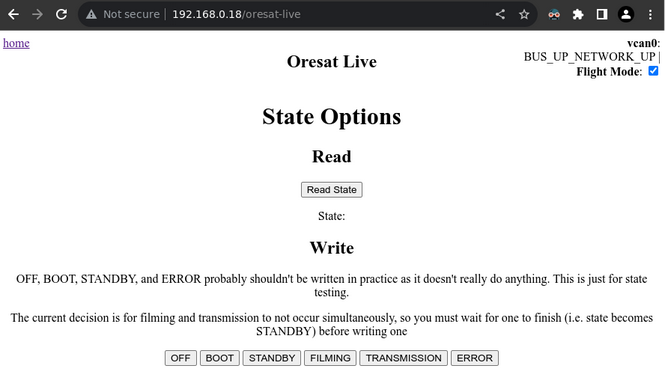
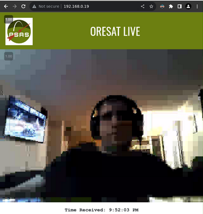

# Table of Contents:
- [Table of Contents:](#table-of-contents)
- [oresat-dxwifi-software](#oresat-dxwifi-software)
  - [Install prerequisites on compatible system](#install-prerequisites-on-compatible-system)
  - [Set up source directories](#set-up-source-directories)
  - [Build and install libdxwifi](#build-and-install-libdxwifi)
  - [Build oresat\_configs](#build-oresat_configs)
  - [Build and install Oresat DxWiFi Software (OLAF app) Package](#build-and-install-oresat-dxwifi-software-olaf-app-package)
  - [Example end-to-end usage](#example-end-to-end-usage)
    - [Notes on debugging](#notes-on-debugging)
    - [Steps for transmitting](#steps-for-transmitting)

# oresat-dxwifi-software

Software for OreSat's DxWiFi board. Part of OreSat Live mission, a real-time
video broadcast from space.

## Install prerequisites on compatible system

At the time of writing, a compatible system is the
[BBB3](https://www.beagleboard.org/boards/beaglebone-black), using the
[oresat-dev-2023-07-30-2gb.img.zst](https://images.oresat.org/oresat-dev-2023-07-30-2gb.img.zst)
image, running the
[Debian GNU/Linux 11 (bullseye)](https://www.debian.org/releases/bullseye/)
distro on
[armhf](https://stackoverflow.com/questions/37790029/what-is-difference-between-arm64-and-armhf)
architecture.

To install prerequisites needed on the BBB, run the following:
```bash
sudo apt -y update && \
sudo apt -y upgrade && \
sudo apt -y install build-essential cmake ffmpeg firmware-ath9k-htc git \
                    libgpiod-dev libpcap-dev libv4l-dev pybind11-dev \
                    python3 python3-pip tcpdump usbutils v4l-utils
```

Note: This step takes close to 11 minutes on the BBB3 with the
oresat-dev-2023-07-30-2gb.img.zst image.

Add a configuration file to ensure the ath9k_htc driver is used with the `mon0`
link by switching to root:
```bash
sudo -s
```

and running the following:
```bash
cat <<EOF > /etc/systemd/network/50-ath9k-htc.link
[Match]
Driver=ath9k_htc
[Link]
Name=mon0
EOF
```

Reboot to ensure the changes are fully applied:
```
$ reboot now
```

## Set up source directories

Run the following command on the BBB `oresat-dev` host to clone the repo and set up output directories:
```bash
mkdir /home/debian/src && \
cd /home/debian/src && \
git clone https://github.com/oresat/oresat-dxwifi-software.git && \
sudo mkdir -p /oresat-live-output/{frames,videos}
```

## Build and install libdxwifi
Clone Repository
```bash
cd /home/debian/src && \
git clone https://github.com/oresat/oresat-libdxwifi.git
```
Build libdxwifi from [instructions](https://github.com/oresat/oresat-libdxwifi#building)

Install the debian packages created from the libdxwifi instructions
```bash
sudo dpkg -i *.deb
```

## Build oresat_configs
Clone Repository
```bash
cd /home/debian/src && \
git clone https://github.com/oresat/oresat-configs
```
Install requirements
```bash
cd oresat-configs && \
sudo pip install -r requirements.txt
sudo ./build_and_install.sh
```


## Build and install Oresat DxWiFi Software (OLAF app) Package
Install requirements
```bash
cd src/oresat-dxwifi-software
sudo pip install -r requirements.txt
```

From the source directory, you can build and install the OLAF app package as
follows:
```bash
./build-deb.sh \
    && sudo apt -y install ./oresat-dxwifi-software-server-*.deb \
    && sudo reboot now
```

Note: The reboot above is not strictly necessary but is recommended to confirm
everything works correctly on startup.

## Example end-to-end usage

Once you have both the BBB and the RPI set up (satellite and HGS, respectively),
you can test `tx` and `rx` and see the frame output in the browser.

To set up the BBB:
* Install the camera software (see
  [oresat_dxwifi/camera/README.md](./oresat_dxwifi/camera/README.md)).
* Install libdxwifi (see the README for
  [OreSat libdxwifi](https://github.com/oresat/oresat-libdxwifi)).
* Install the OLAF app as described in the
  [previous section]((#build-and-install-oresat-dxwifi-software-olaf-package)).

To set up the RPI:
* Install the OreSat Live server (see the README for
[OreSat Live Software Server](https://github.com/oresat/oresat-live-software/tree/master/server)).
* Install libdxwifi (see the README for
[OreSat libdxwifi](https://github.com/oresat/oresat-libdxwifi)).

If you have set up the BBB correctly, you should be able to confirm the OLAF app
services are running properly as follows:

```
$ sudo systemctl status oresat-mon-iface.service \
                        oresat-vcan-iface.service \
                        oresat-dxwifi-software-server.service
● oresat-mon-iface.service - Oresat MON0 IFACE Service
  Loaded: loaded (/lib/systemd/system/oresat-mon-iface.service; enabled; vendor preset: enabled)
  Active: inactive (dead) since Wed 2023-11-22 23:05:19 UTC; 24s ago
  Process: 705 ExecStart=ifconfig mon0 up (code=exited, status=0/SUCCESS)
   Main PID: 705 (code=exited, status=0/SUCCESS)
      CPU: 15ms

Nov 22 23:05:19 oresat-dev systemd[1]: Started Oresat MON0 IFACE Service.
Nov 22 23:05:19 oresat-dev systemd[1]: oresat-mon-iface.service: Succeeded.

● oresat-vcan-iface.service - Oresat VCAN0 IFACE Service
  Loaded: loaded (/lib/systemd/system/oresat-vcan-iface.service; enabled; vendor preset: enabled)
  Active: inactive (dead) since Wed 2023-11-22 23:05:19 UTC; 24s ago
  Process: 706 ExecStart=/usr/local/sbin/start-vcan (code=exited, status=0/SUCCESS)
   Main PID: 706 (code=exited, status=0/SUCCESS)
      CPU: 34ms

Nov 22 23:05:19 oresat-dev systemd[1]: Started Oresat VCAN0 IFACE Service.
Nov 22 23:05:19 oresat-dev systemd[1]: oresat-vcan-iface.service: Succeeded.

● oresat-dxwifi-software-server.service - Oresat DXWIFI Software Server
  Loaded: loaded (/lib/systemd/system/oresat-dxwifi-software-server.service; enabled; vendor preset: enabled)
  Active: active (running) since Wed 2023-11-22 23:05:19 UTC; 25s ago
   Main PID: 707 (python3)
    Tasks: 10 (limit: 1026)
  Memory: 19.9M
      CPU: 13.046s
  CGroup: /system.slice/oresat-dxwifi-software-server.service
          └─707 python3 -m oresat_dxwifi

Nov 22 23:05:40 oresat-dev python3[707]: 2023-11-22 23:05:40.520 | ERROR  | oresat_dxwifi.resources.temperature:find_temperature:83 - Unable to reach ADC
```

The following log messages are expected on the BBB. The OreSat Live board is
connected to a temperature sensor on the satellite, but the BBB has no such
sensor.
```
2023-11-22 02:01:21.696 | ERROR | oresat_dxwifi.resources.temperature:find_temperature:83 - Unable to reach ADC
2023-11-22 02:01:21.700 | ERROR | oresat_dxwifi.resources.temperature:_on_read_temperature:54 - Temperature outside int8 range or unable to reach ADC.
```

The following command follows the log with temperature messages excluded.
```
$ tail -f /tmp/olaf.log | grep -vi temperature
```

### Notes on debugging

When the DxWiFi OLAF app is running in a subprocess in the background, some of
the output doesn't go to the `olaf.log` file. To have the full debug output sent
to the terminal, you can run the app in the foreground as follows:
```
$ sudo systemctl stop oresat-dxwifi-software-server.service;
$ sudo su -l
# cd /usr/local/sbin/
# python3 -m oresat_dxwifi | grep -vi temperature
# exit
```

When the app is running (either via systemd or in the foreground), it listens on
`127.0.0.1:8000`, and Nginx runs a reverse proxy to this port. You can
administer the app in a web browser by visiting
`http://<bbb-address>/oresat-live` (replacing `<bbb-address>` with the IP
address or hostname of the BBB).



### Steps for transmitting

Press `Read State`. The page should now say "Standby." If it says "Error,"
there is a problem to be debugged.

Press `FILMING`. The logs should say something like this:

```
2023-11-22 02:03:21.332 | INFO  | oresat_dxwifi.services.oresat_live:on_state_write:119 - Changing state: STANDBY -> FILMING
...
2023-11-22 01:50:29.275 | INFO  | oresat_dxwifi.camera.camera:create_videos:162 - Finished, videos available at: /oresat-live-output/videos
```

Press `TRANSMISSION`. The logs should say something like this:
```
2023-11-22 02:05:25.199 | INFO  | oresat_dxwifi.services.oresat_live:on_state_write:119 - Changing state: STANDBY -> TRANSMISSION
```

After you press `TRANSMISSION`, go to the browser connected to the HGS app (the
OreSat Live Server), and you should see the transmission coming in. It should
look something like this:


